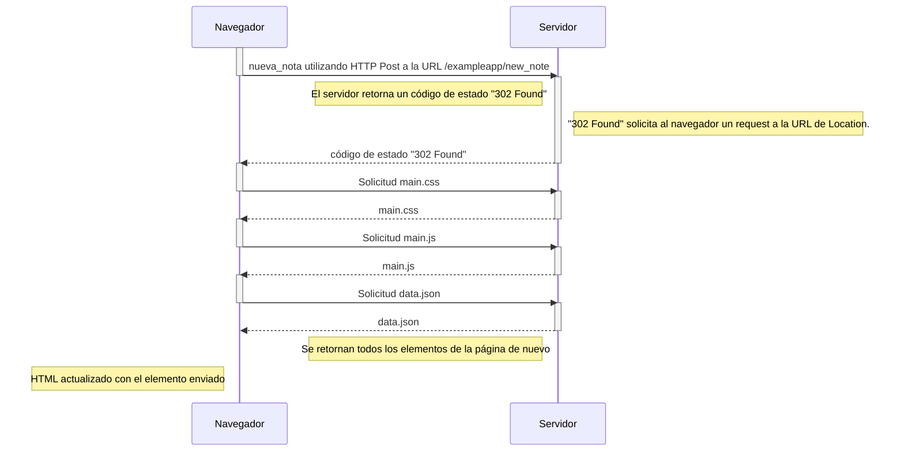

```mermaid
sequenceDiagram
    participant Navegador
    participant Servidor
    activate Navegador
    Navegador->>Servidor: nueva_nota utilizando HTTP Post a la URL /exampleapp/new_note
    deactivate Navegador
    activate Servidor
    Note left of Servidor: El servidor retorna un código de estado "302 Found"
    Note right of Servidor: "302 Found" solicita al navegador un request a la URL de Location.
    Servidor-->> Navegador: código de estado "302 Found" 
    deactivate Servidor
    activate Navegador
    Navegador->>Servidor: Solicitud main.css
    deactivate Navegador
    activate Servidor
    Servidor-->>Navegador: main.css
    deactivate Servidor
    activate Navegador
    Navegador->>Servidor: Solicitud main.js
    deactivate Navegador
    activate Servidor
    Servidor-->>Navegador: main.js
    deactivate Servidor
    activate Navegador
    Navegador->>Servidor: Solicitud data.json
    deactivate Navegador
    activate Servidor
    Servidor-->>Navegador: data.json
    deactivate Servidor
    Note left of Servidor: Se retornan todos los elementos de la página de nuevo
    Note left of Navegador: HTML actualizado con el elemento enviado
```
