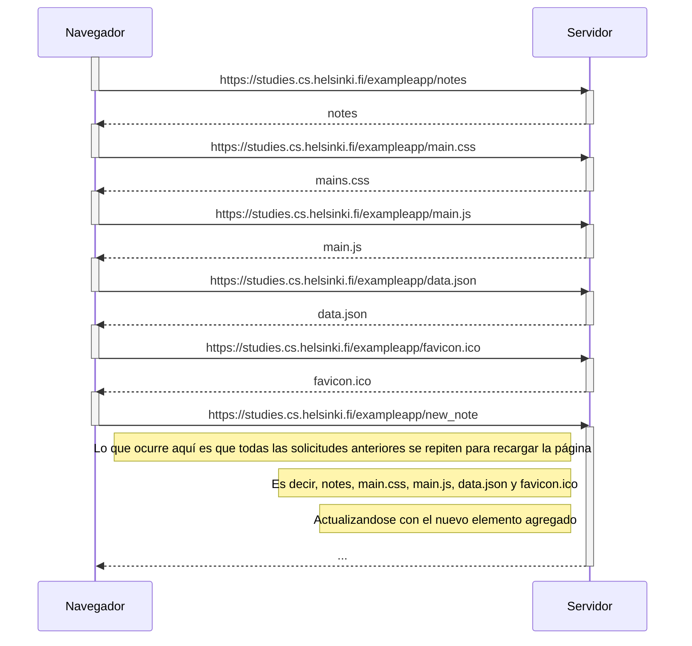

```mermaid
sequenceDiagram
    participant Navegador
    participant Servidor
        activate Navegador
            Navegador->>Servidor: https://studies.cs.helsinki.fi/exampleapp/notes
        deactivate Navegador
        activate Servidor
            Servidor-->>Navegador: notes
        deactivate Servidor
        activate Navegador
            Navegador->>Servidor: https://studies.cs.helsinki.fi/exampleapp/main.css
        deactivate Navegador
        activate Servidor
            Servidor-->>Navegador: mains.css
        deactivate Servidor
        activate Navegador
            Navegador->>Servidor: https://studies.cs.helsinki.fi/exampleapp/main.js
        deactivate Navegador
        activate Servidor
            Servidor-->>Navegador: main.js
        deactivate Servidor
        activate Navegador
            Navegador->>Servidor: https://studies.cs.helsinki.fi/exampleapp/data.json
        deactivate Navegador
        activate Servidor
            Servidor-->>Navegador: data.json
        deactivate Servidor
        activate Navegador
            Navegador->>Servidor: https://studies.cs.helsinki.fi/exampleapp/favicon.ico
        deactivate Navegador
        activate Servidor
            Servidor-->>Navegador: favicon.ico
        deactivate Servidor
        activate Navegador
            Navegador->>Servidor: https://studies.cs.helsinki.fi/exampleapp/new_note
        deactivate Navegador
        activate Servidor
            Note left of Servidor: Lo que ocurre aquí es que todas las solicitudes anteriores se repiten para recargar la página
            Note left of Servidor: Es decir, notes, main.css, main.js, data.json y favicon.ico 
            Note left of Servidor: Actualizandose con el nuevo elemento agregado
            Servidor-->>Navegador: ...
        deactivate Servidor
```
