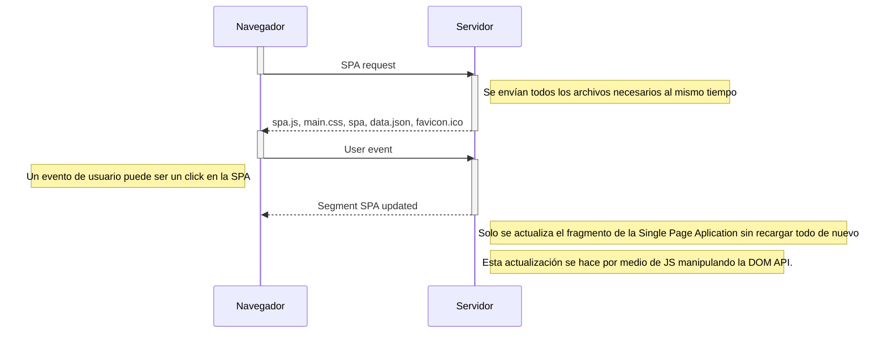

```mermaid
sequenceDiagram
    participant Navegador
    participant Servidor
    activate Navegador
    Navegador->>Servidor: SPA request
    deactivate Navegador
    activate Servidor
    Note right of Servidor: Se envían todos los archivos necesarios al mismo tiempo
    Servidor-->>Navegador: spa.js, main.css, spa, data.json, favicon.ico
    deactivate Servidor
    activate Navegador
    Navegador->>Servidor: User event
    deactivate Navegador
    activate Servidor
    Note left of Navegador: Un evento de usuario puede ser un click en la SPA
    Servidor-->>Navegador: Segment SPA updated
    deactivate Servidor
    Note right of Servidor: Solo se actualiza el fragmento de la Single Page Aplication sin recargar todo de nuevo
    Note right of Servidor: Esta actualización se hace por medio de JS manipulando la DOM API.
```
